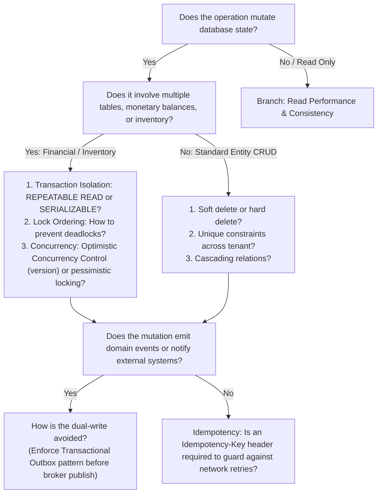
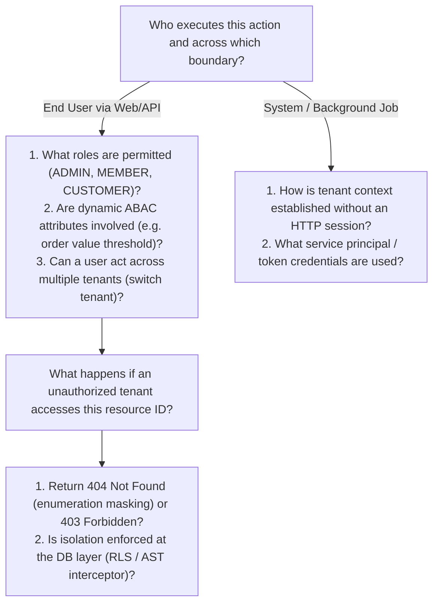
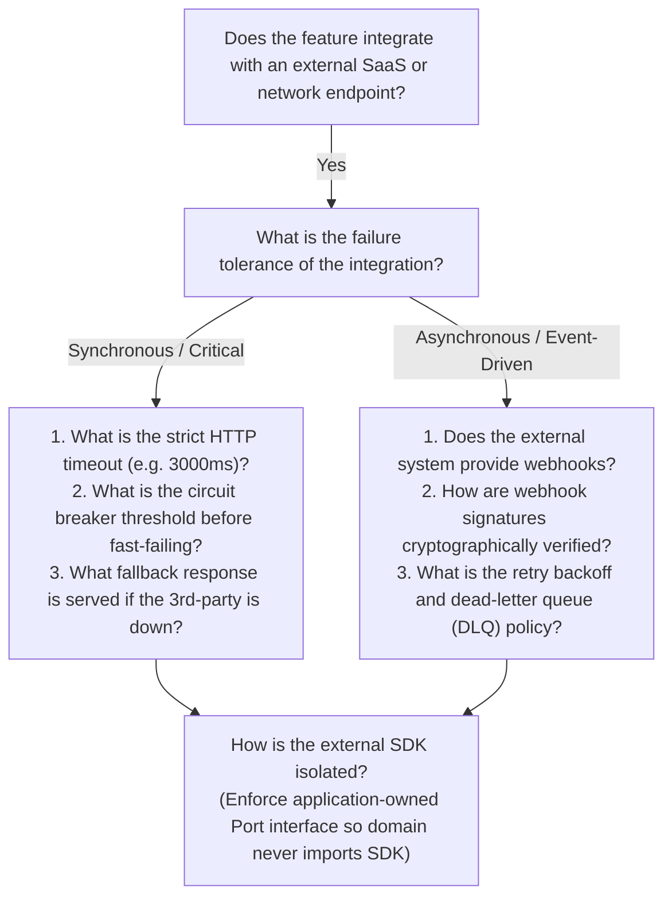
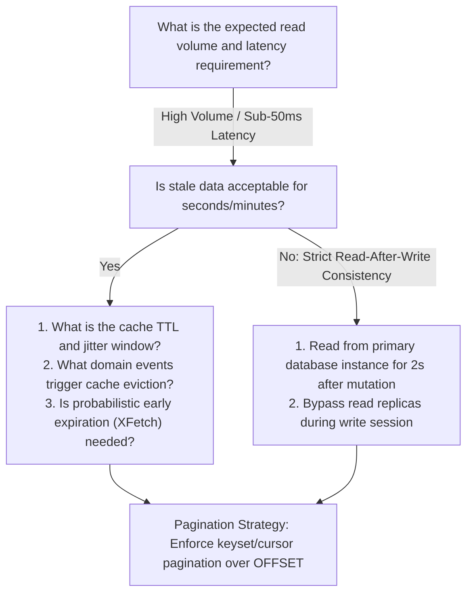

# Adaptive Questioning Trees & Contextual Branching Matrices

> **Core Purpose:** Detailed decision trees for the `relentless-questioner` skill, demonstrating how subsequent questions adapt dynamically based on previous user responses.

---

## Decision Tree 1: Mutating Operations & State Changes

---

## Decision Tree 2: Multi-Tenancy & Authorization Boundaries

---

## Decision Tree 3: External Integrations & 3rd-Party APIs

---

## Decision Tree 4: Read Performance, Caching & Search

---

## Contextual Follow-Up Patterns

When conducting the interview, use this exact syntax pattern to chain questions adaptively:

1. **Acknowledge and Pin Previous Answer**:
   `"Understood, you specified [Option A] for [Requirement X]."`
2. **Surface Immediate Architectural Implication**:
   `"Because of [Option A], [Potential Failure / Edge Case Y] becomes the primary risk."`
3. **Ask Context-Dependent Question**:
   `"How should the system behave when [Condition Y] occurs? Specifically:"`
   - *Sub-question 1*
   - *Sub-question 2*
