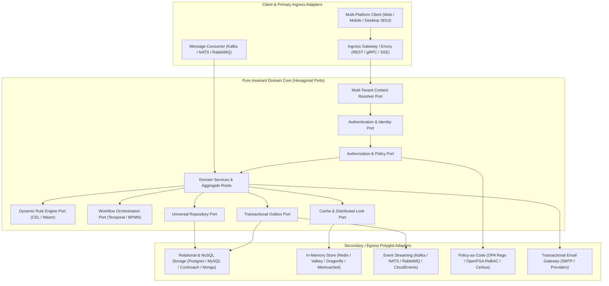
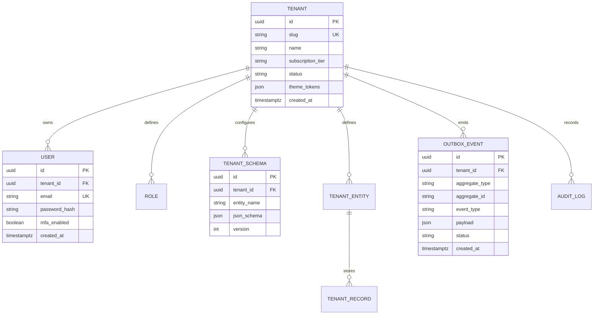
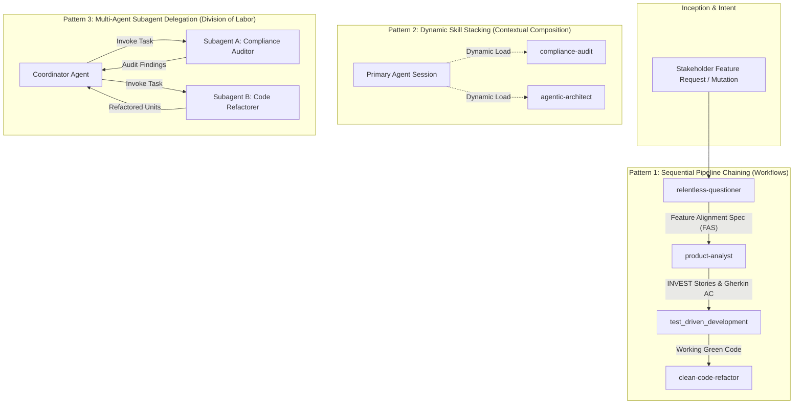

# System Knowledge Graph & Architectural Topology

> **Core Purpose:** High-density, token-efficient knowledge representation of the workspace architecture, data topologies, and subsystem boundaries, eliminating repetitive discovery prompts.

---

## 1. Universal Hexagonal Architectural Subsystems

---

## 2. Multi-Tenant Data Isolation & Schema Graph

---

## 3. Subsystem Fast Lookup Index

| Capability | Invariant Contract / Open Standard | Swappable Polyglot Adapters | Governing Rule |
|---|---|---|---|
| **Runtime & Language** | Hexagonal Core (Zero Deps) | Polyglot (Go, Rust, Python, Java, TypeScript) | [`clean_code.md`](../rules/clean_code.md) |
| **Type Safety** | Sound static types & branded primitives | Rust, TypeScript, Go, Python (type hints) | [`typescript.md`](../rules/typescript.md) |
| **Persistence / DAL** | Abstract Repository & Unit of Work | Atlas / Flyway migrations; SQL & NoSQL drivers | [`database_transactions.md`](../rules/database_transactions.md) |
| **Tenant Isolation** | 4 Models (AST Interceptor, Schema, DB, Proxy) | SQL AST parser, RLS, multi-pool router, Envoy | [`multitenancy_isolation.md`](../rules/multitenancy_isolation.md) |
| **Dynamic Schemas** | JSON Schema Draft 2020-12 | Polyglot validators (`valico`, `gojsonschema`, `ajv`) | [`tenant_dynamic_schemas.md`](../rules/tenant_dynamic_schemas.md) |
| **Authentication** | OIDC, OAuth 2.1, Passkeys (WebAuthn) | PASETO, JWT with JWKS, SPIFFE/SPIRE mTLS | [`authentication.md`](../rules/authentication.md) |
| **Authorization** | Policy-as-Code & ReBAC | OPA (Rego/Wasm), OpenFGA (Zanzibar), Cerbos | [`authorization.md`](../rules/authorization.md) |
| **Pluggable Logic** | Common Expression Language (CEL) / Wasm | `cel-go`, `cel-rust`, Extism (Wasm plugins) | [`tenant_pluggable_logic.md`](../rules/tenant_pluggable_logic.md) |
| **Workflows** | Durable Orchestration & Statecharts | Temporal.io SDKs, Camunda/Zeebe (BPMN 2.0) | [`tenant_pluggable_logic.md`](../rules/tenant_pluggable_logic.md) |
| **Caching** | Abstract Cache Port with XFetch | Redis, Valkey, Dragonfly, Memcached, Local LRU | [`caching.md`](../rules/caching.md) |
| **Feature Flags** | OpenFeature Standard | Flipt, Unleash, LaunchDarkly, GoFeatureFlag | [`feature_flags.md`](../rules/feature_flags.md) |
| **Testing** | Outside-In TDD, BDD & Consumer Contracts | Cucumber/Gherkin, Pact, Schemathesis | [`test_driven_development.md`](../rules/test_driven_development.md) |
| **Presentation / SDUI** | Declarative JSON SDUI + DTCG Tokens | Web (React/Vue/Svelte), Mobile (Flutter/Native) | [`server_driven_ui.md`](../rules/server_driven_ui.md) |
| **Transactional Email** | Declarative Email Specs / MJML | SMTP Gateway, Mailpit (Local), SES/Sendgrid | [`transactional_email.md`](../rules/transactional_email.md) |
| **Event Streaming** | CNCF CloudEvents v1.0.2 | Kafka, NATS JetStream, RabbitMQ, SQS | [`database_transactions.md`](../rules/database_transactions.md) |
| **Observability** | OpenTelemetry OTLP standard | OTel Collector, Jaeger, Prometheus, OpenSearch | [`cloud_native.md`](../rules/cloud_native.md) |

---

## 4. Agentic Skill Topology & Composability Matrix

### Many-to-Many Skill Cross-Matrix

| Skill Name | Functional Specialty | Applicable Lifecycle Stages | Target Artifacts Produced |
|---|---|---|---|
| `relentless-questioner` | Context-aware ambiguity interrogation | Pre-Discovery, Pre-Planning | Feature Alignment Spec (FAS), Invariant List |
| `product-analyst` | Requirements decomposition & Gherkin | Phase 1: Requirements | INVEST User Stories, Gherkin Scenarios |
| `lets-build` | Technical infrastructure scaffolding | Initial Bootstrapping only | Package manifests, build configs, `/healthz` |
| `clean-code-refactor` | Code smell eradication, GoF patterns | Phase 4: TDD Inner Loop | Decoupled classes, small functions (< 30 lines) |
| `compliance-audit` | Security & compliance verification | Phase 1, Phase 5: DoD | Gitleaks, Semgrep, Trivy, OWASP audit logs |
| `agentic-architect` | Agent configuration & skill governance | Continuous meta-refinement | Atomic `SKILL.md`, `AGENTS.md`, ADR records |
