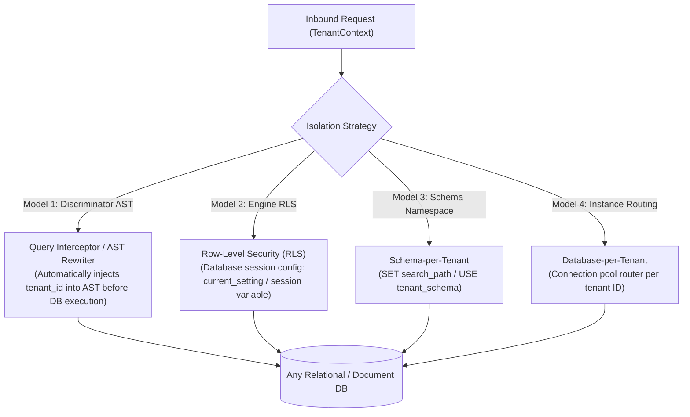

# Multi-Tenancy Context Resolution & Data Isolation Models

> **Core Mandate:** Enforce multi-tenancy isolation through dynamic context resolution combined with database-agnostic isolation models (AST query interceptors, RLS, schema namespaces, or connection routing) as an immutable backstop.

---

## 1. Multi-Tenant Context Resolution

Resolve tenant identity dynamically in an inbound gateway or middleware pipeline in strict priority order:
1. **Host Subdomain**: `subdomain.app.com` (extracted via hostname regex).
2. **Explicit Headers**: `X-Tenant-ID: <uuid>` or `X-Tenant-Slug: <slug>`.
3. **Path Prefix**: `/t/:tenantSlug/...`.
4. **JWT Claim Fallback**: Authenticated token `tid` (tenant ID) claim.

*Validation:* If the resolved tenant does not exist or is in `SUSPENDED` status, immediately return **`403 Forbidden`** (`TENANT_SUSPENDED` or `TENANT_INVALID`). Propagate `TenantContext` across service calls using standard W3C Baggage headers or request contexts.

---

## 2. Four Universal Data Isolation Models

Never rely solely on application developers remembering to manually append `WHERE tenant_id = ?`. Standardize on one of four architectural isolation strategies:



### Model 1: Universal AST Query Interceptor (Engine-Agnostic)
The persistence layer interceptor parses the query Abstract Syntax Tree (AST) at runtime and automatically enforces `tenant_id = current_tenant` for all reads and mutations. Compatible with all ANSI SQL and NoSQL engines.

### Model 2: Database Row-Level Security (RLS)
For engines supporting native RLS (e.g. PostgreSQL, Oracle):
```sql
ALTER TABLE "Order" ENABLE ROW LEVEL SECURITY;
ALTER TABLE "Order" FORCE ROW LEVEL SECURITY;

CREATE POLICY order_tenant_isolation ON "Order"
  FOR ALL
  USING (tenant_id = current_setting('app.tenant_id', true)::uuid)
  WITH CHECK (tenant_id = current_setting('app.tenant_id', true)::uuid);
```
> [!IMPORTANT]
> **Connection Pool Safety:** Always set `is_local = true` when configuring session variables (`set_config('app.tenant_id', id, true)`). This restricts settings strictly to the current database transaction, preventing cross-tenant leakage in connection pools.

### Model 3: Schema-per-Tenant
Separate schemas per tenant within a shared database instance (`tenant_acme`, `tenant_globex`). Routing dynamically sets the active search path per transaction.

### Model 4: Database-per-Tenant
Dedicated physical database instances per enterprise tenant, selected by a dynamic connection pool resolver based on resolved tenant metadata.

---

## 3. Polyglot Adapter Interceptor Contract

Adapters in any language (Go, Rust, Python, Java, TypeScript) must expose an interceptor wrapping the data access layer:

```
┌────────────────────────────────────────────────────────┐
│ Context Interceptor Contract (Pseudocode / Polyglot)   │
├────────────────────────────────────────────────────────┤
│ onQueryExecution(query, tenantContext):                │
│   assert(tenantContext != null, "MissingTenantContext")│
│   if adapter.supportsRLS():                            │
│     execute("SET LOCAL app.tenant_id = :tenantId")     │
│   else if adapter.supportsAST():                       │
│     query.addPredicate(EQUALS("tenant_id", tenantId))  │
│   return execute(query)                                │
└────────────────────────────────────────────────────────┘
```

---

## 4. Tenant Lifecycle Management

- **Atomic Provisioning**: Tenant creation must run inside an atomic transaction (provision tenant record, seed default RBAC roles `ADMIN`/`MEMBER`, assign subscription tier).
- **GDPR Cascading Deletion**: Deleting a tenant triggers an asynchronous job that cascade purges or pseudonymizes all tenant records, ensuring zero orphaned data.
